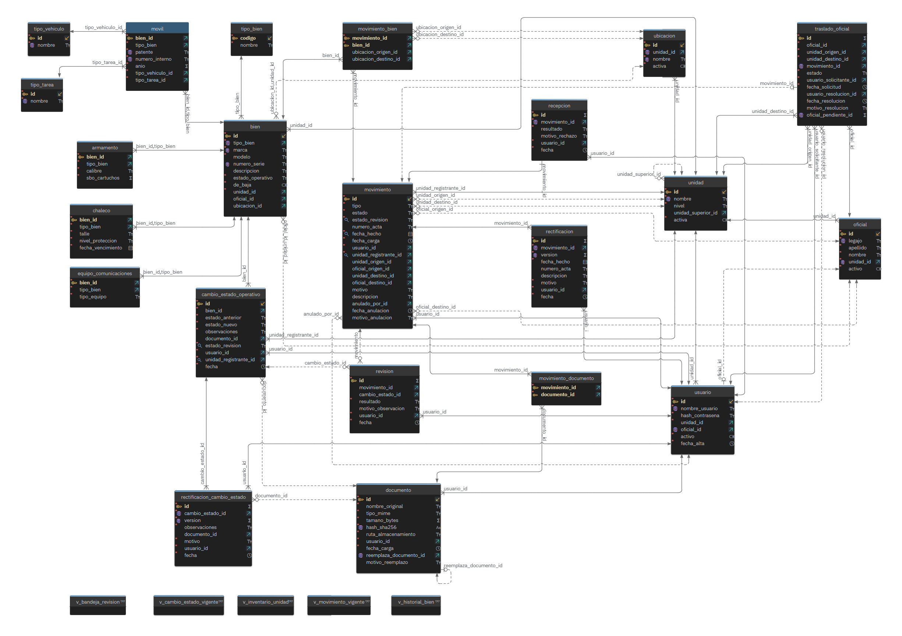

# Sistema Logístico Policial

## Segunda entrega: diseño de la base de datos y módulos

Universidad Tecnológica Nacional

Tecnicatura Universitaria en Programación a Distancia

Trabajo Final Integrador, Grupo 161

Mariano Rodríguez Arce y Raul Robino

---

En esta entrega presentamos el esquema de la base de datos y los módulos que vamos a desarrollar en el repositorio. El diseño parte del problema que definimos en la primera entrega y de la propuesta de MVP.

Contenido

1. Alcance y cambios respecto del MVP
2. Circuitos que modela el esquema
3. Modelo de datos
4. Diccionario de datos
5. Módulos a desarrollar

## 1. Alcance y cambios respecto del MVP

El sistema centraliza la información de cuatro tipos de bienes logísticos que se identifican de forma individual: armamento, chalecos balísticos, móviles y equipos de comunicaciones. Para cada bien registra quién lo tiene, dónde está, qué movimientos tuvo y qué documentación los respalda. Lo usa solamente el personal logístico de la Dirección Logística, de las Unidades Regionales y de las Unidades Operacionales. Los oficiales que reciben dotaciones no acceden al sistema.

Dejamos fuera de esta versión la munición, el kilometraje y el mantenimiento de los móviles, el resto del equipamiento policial y las alertas de vencimiento. La organización y los datos de ejemplo son ficticios.

Al pasar el MVP a un diseño de datos ajustamos algunas definiciones. La tabla resume los cambios.

| Tema | En el MVP | En este diseño |
|---|---|---|
| Alta de bienes | La tabla de roles también se la asignaba al Auxiliar Logístico. | Es exclusiva de Dirección y el bien se crea en una ubicación de Dirección. El inventario que ya existe en las unidades lo precargamos nosotros antes de la puesta en marcha. |
| Roles | Sala de Armas y Auxiliar Logístico tenían permisos separados en la Unidad Operacional. | Hay un solo rol por nivel de unidad. En la Unidad Operacional, el Auxiliar Logístico opera los cuatro tipos de bien. La separación por área se mantiene en las actas. |
| Movimiento y acta | Un movimiento por cada bien, con acta solo en la entrega. | Un movimiento equivale a un acta y puede incluir varios bienes. El acta es obligatoria en entregas, traslados y bajas. |
| Recepción y devolución | Se confirmaba el movimiento completo y la devolución no estaba diferenciada. | El destino acepta o rechaza el acta completa, y si la rechaza los bienes quedan en el origen. Cuando un oficial devuelve un bien a su unidad, la devolución se aplica en el acto porque la registra la misma unidad que recibe. |
| Dotaciones y traslados | La dotación era una entrega a un oficial puntual y el traslado se aplicaba en el momento. | Solo se dota a oficiales de la misma unidad, que sigue siendo la dueña del bien. El traslado de un oficial incluye todas sus dotaciones y queda pendiente hasta que la unidad de destino lo confirma o lo rechaza. |
| Estado operativo | Estaba fuera del MVP para los móviles. | Se aplica a los cuatro tipos y no es un movimiento. Para pasar un bien a fuera de servicio se adjunta un informe técnico en PDF con observaciones, y para volver a ponerlo en servicio alcanza con las observaciones. Un bien fuera de servicio no se asigna en dotación permanente. |
| Reubicación interna | No estaba contemplada. | Es un nuevo tipo de movimiento dentro de la unidad, sin acta ni revisión. |
| Revisión | Dirección hacía una revisión final de todos los movimientos. | Revisa solo el superior inmediato, tanto movimientos como cambios de estado. Lo que registra Dirección no se revisa. |
| Correcciones y anulaciones | Se podía corregir quién, qué y cuándo, y editar los datos descriptivos. Solo un rol superior podía anular. | Se corrigen la fecha, el número de acta y la descripción, y cada corrección queda guardada como una versión nueva. Si se cargó un bien equivocado, se anula el acta completa y el autor la vuelve a cargar con los datos correctos. La Regional puede anular las actas de sus Unidades Operacionales y las propias, y Dirección las de los tres niveles. |

### Criterios de éxito

Los criterios de éxito del MVP se mantienen. Los dos últimos cambian de redacción por los ajustes de la tabla anterior: lo que registra Dirección y las reubicaciones no tienen revisión, y las reubicaciones no llevan acta.

| Criterio | Cómo lo cubre este diseño |
|---|---|
| 1. Trazabilidad en una sola consulta | La tabla bien guarda la tenencia y el estado actuales de cada bien, y su historial se arma con los movimientos y los cambios de estado. |
| 2. Cero recarga manual del mismo dato | Cada acta se carga una sola vez. Ese registro alimenta el historial del bien, la bandeja de revisión del superior, que reemplaza al parte informativo, y los reportes. |
| 3. Visibilidad consolidada sin desfasaje mensual | El inventario se consulta en cualquier momento por unidad, por Regional o a nivel nacional. |
| 4. Revisión de todo lo que registran las unidades dependientes | Todo movimiento o cambio de estado que registra una Unidad Operacional o Regional queda pendiente, revisado u observado. No se revisan las reubicaciones ni lo que registra Dirección, porque no tiene superior. |
| 5. Resguardo digital de la documentación | Toda entrega, traslado y baja lleva el acta escaneada, y todo paso a fuera de servicio lleva el informe técnico. |

## 2. Circuitos que modela el esquema

Todo lo que cambia la tenencia de un bien se registra como un movimiento. Los cambios de estado operativo van aparte porque no mueven el bien. Con los dos se arma el historial de cada bien y se alimenta la bandeja de revisión del superior, que reemplaza al parte informativo.

| Tipo | Origen y destino | Recepción | Acta | Revisión | Efecto sobre el bien |
|---|---|---|---|---|---|
| ALTA | Sin origen. El destino es una ubicación de Dirección. | No corresponde | Opcional | No corresponde | Se crea el bien con su ficha, en servicio. |
| ENTREGA entre unidades | De una unidad a otra | Queda pendiente y el destino acepta o rechaza el acta completa | Obligatoria | Sí | Al recibirse cambian la unidad dueña y la ubicación. |
| ENTREGA de dotación | De la unidad a uno de sus oficiales | Se aplica en el acto | Obligatoria | Sí | El oficial pasa a ser el responsable y la unidad sigue siendo la dueña. |
| ENTREGA de devolución | Del oficial a su unidad | Se aplica en el acto | Obligatoria | Sí | El bien vuelve a una ubicación de la unidad. |
| REUBICACION | Entre dos ubicaciones de la misma unidad | Se aplica en el acto | No | No | Cambia la ubicación. |
| TRASLADO | Un oficial pasa de una unidad a otra | Queda pendiente y el destino confirma o rechaza todo | Obligatoria | Sí | El oficial y sus dotaciones pasan a la unidad de destino. |
| BAJA | Desde la unidad dueña, sin destino | Se aplica en el acto | Obligatoria | Sí | El bien sale de circulación. |

Cuando el movimiento lo registra Dirección no hay revisión, porque Dirección no tiene un superior.

Los cambios de estado operativo funcionan así:

| Cambio | Documentación | Observaciones | Revisión |
|---|---|---|---|
| De en servicio a fuera de servicio | Informe técnico escaneado en PDF | Motivo del cambio | Sí |
| De fuera de servicio a en servicio | No hace falta | Qué se reparó y constancia de que el bien quedó operativo | Sí |

Cada cambio corresponde a un solo bien y no modifica su tenencia. Un bien fuera de servicio no se puede entregar en dotación permanente, pero sí devolver a la unidad o entregar a otra unidad.

Las reglas principales que sostiene el esquema son estas:

- Un bien activo tiene un solo responsable. Está en una ubicación de su unidad o asignado a un oficial de esa misma unidad.
- Mientras una entrega o un traslado está pendiente, el responsable sigue siendo el origen y el bien no admite otro movimiento.
- Cada acta incluye bienes de una sola área: armamento y chalecos, o móviles y equipos de comunicaciones.
- La revisión la hace el superior inmediato después del hecho. Si observa un registro indica el motivo, y la corrección la hace el autor.
- No se borra ningún registro. Las correcciones se guardan como versiones nuevas. Las anulaciones llevan un motivo y cubren siempre el acta completa. La Regional puede anular las actas de sus Unidades Operacionales y las propias, y Dirección las de los tres niveles.
- Solo se anula un movimiento si ninguno de sus bienes tuvo movimientos posteriores. Si los tuvo, se anulan primero esos. Al anularse un movimiento aplicado, cada bien vuelve a la unidad, el oficial y la ubicación de origen.
- Una Unidad Operacional no puede retirar un traslado que solicitó. Si hay que cancelarlo, lo anula su Regional o Dirección.
- Solo se da de baja un bien que está en depósito y no tiene movimientos pendientes.

Lo que puede hacer cada usuario depende del nivel de su unidad:

| Nivel | Rol | Consulta | Opera | Revisa y anula |
|---|---|---|---|---|
| Unidad Operacional | Auxiliar Logístico | Los bienes de su unidad, con su historial, y las dotaciones de sus oficiales | Entregas, recepciones, dotaciones, devoluciones, reubicaciones, bajas y cambios de estado de los bienes de su unidad. Solicita traslados de sus oficiales y confirma o rechaza los que llegan. Administra los oficiales y las ubicaciones de su unidad. | No corresponde |
| Unidad Regional | Logístico Regional | Los bienes propios de la Regional, y el inventario, las dotaciones y el historial de sus Unidades Operacionales | Las mismas operaciones sobre los bienes, los oficiales y las ubicaciones de la Regional | Revisa los movimientos y cambios de estado de sus Unidades Operacionales. Anula las actas de sus Unidades Operacionales y las propias. |
| Dirección | Dirección Logística | Todo el inventario, a nivel nacional | Alta de bienes nuevos y las mismas operaciones sobre lo propio de Dirección. Administra usuarios, unidades y catálogos. | Revisa los movimientos y cambios de estado de las Regionales. Anula las actas de los tres niveles. |

## 3. Modelo de datos

Elegimos una base de datos relacional con MySQL 8. Operaciones como una recepción o un traslado modifican varias filas que tienen que actualizarse juntas, y un bien nunca puede quedar sin responsable ni apuntar a una unidad u oficial que no existe. Eso pide transacciones e integridad referencial, que es justamente lo que ofrece el modelo relacional según los criterios que vimos en Bases de Datos II. Además, la estructura de los datos se conoce de antemano y no necesitamos la flexibilidad de una base documental. MySQL es el motor que usamos en Bases de Datos I.

### Diagrama Entidad-Relación



Los bienes se modelan como una generalización. La tabla bien tiene los datos comunes y cada tipo tiene su ficha en una tabla aparte. El movimiento representa un acta, con la cabecera en movimiento y un renglón por cada bien en movimiento_bien. Los cambios de estado operativo tienen su propia tabla y comparten con los movimientos la tabla de revisiones, donde cada revisión apunta a uno o al otro.

El esquema está en tercera forma normal. Algunos datos que se podrían calcular desde el historial, como la tenencia y el estado actual de cada bien, los guardamos igual para consultar el inventario de forma directa.

## 4. Diccionario de datos

Usamos nombres en snake_case y claves primarias numéricas autoincrementales, salvo en tipo_bien, que usa un código de texto. Las tablas que solo relacionan otras dos usan una clave compuesta. Los campos INT son enteros sin signo. Todas las columnas son obligatorias salvo las que figuran como opcionales.

### Organización y acceso

La tabla **unidad** guarda la estructura de Dirección, Regionales y Operacionales.

| Columna | Tipo | Descripción |
|---|---|---|
| id | INT | PK |
| nombre | VARCHAR(100) | Único |
| nivel | ENUM | DIRECCION, REGIONAL u OPERACIONAL |
| unidad_superior_id | INT | FK a unidad. Opcional, porque Dirección no tiene superior. |
| activa | BOOLEAN | Permite dar de baja la unidad sin borrarla |

La tabla **ubicacion** tiene los lugares físicos de cada unidad, como el depósito o la sala de armas.

| Columna | Tipo | Descripción |
|---|---|---|
| id | INT | PK |
| unidad_id | INT | FK a unidad |
| nombre | VARCHAR(100) | No se repite dentro de la misma unidad |
| activa | BOOLEAN | |

En **oficial** está el personal que puede recibir dotaciones.

| Columna | Tipo | Descripción |
|---|---|---|
| id | INT | PK |
| legajo | VARCHAR(20) | Único |
| apellido, nombre | VARCHAR(80) | |
| unidad_id | INT | FK a unidad. Unidad donde revista actualmente. |
| activo | BOOLEAN | |

En **usuario** están las cuentas del personal logístico.

| Columna | Tipo | Descripción |
|---|---|---|
| id | INT | PK |
| nombre_usuario | VARCHAR(50) | Único |
| hash_contrasena | VARCHAR(255) | Hash de la contraseña generado con bcrypt o argon2 |
| unidad_id | INT | FK a unidad |
| oficial_id | INT | FK a oficial. Opcional. |
| activo | BOOLEAN | Una cuenta desactivada no se borra |
| fecha_alta | DATETIME | |

No hay tabla de roles. Como hay un solo rol por nivel de unidad, los permisos de cada usuario se deducen del nivel de su unidad.

### Bienes

Las tablas **tipo_bien**, **tipo_vehiculo** y **tipo_tarea** son catálogos que administra Dirección.

| Tabla | Columnas | Descripción |
|---|---|---|
| tipo_bien | codigo VARCHAR(30) PK, nombre VARCHAR(60) | ARMAMENTO, CHALECO, MOVIL y EQUIPO_COMUNICACIONES |
| tipo_vehiculo | id INT PK, nombre VARCHAR(60) único | Tipo de móvil, por ejemplo camioneta, sedán o motocicleta |
| tipo_tarea | id INT PK, nombre VARCHAR(60) único | Uso asignado al móvil: investigaciones, patrullaje, transporte de pasajeros o transporte de carga |

Con tipo_vehiculo, tipo_tarea y el estado operativo se responden pedidos de Dirección como cuántas camionetas de patrullaje están en servicio.

La tabla **bien** guarda los datos comunes y la tenencia actual.

| Columna | Tipo | Descripción |
|---|---|---|
| id | INT | PK |
| tipo_bien | VARCHAR(30) | FK a tipo_bien |
| marca, modelo | VARCHAR(60) | |
| numero_serie | VARCHAR(50) | Obligatorio salvo en móviles. No se repite para el mismo tipo y marca. |
| descripcion | VARCHAR(255) | Opcional |
| estado_operativo | ENUM | EN_SERVICIO o FUERA_DE_SERVICIO |
| de_baja | BOOLEAN | |
| unidad_id | INT | FK a unidad. Es la unidad dueña, en cuyo inventario figura el bien. |
| oficial_id | INT | FK a oficial. Opcional, se completa cuando el bien está en dotación. |
| ubicacion_id | INT | FK a ubicacion. Opcional, se completa cuando el bien está en depósito. |

Cuando un oficial cambia de unidad, la base actualiza automáticamente la unidad de sus dotaciones, de modo que un bien asignado siempre pertenece a la unidad de su oficial.

Cada ficha específica usa el mismo id del bien como clave.

| Tabla | Datos propios |
|---|---|
| armamento | calibre VARCHAR(20) y sbo_cartuchos SMALLINT, que es solo informativo |
| chaleco | talle VARCHAR(10), nivel_proteccion VARCHAR(10) y fecha_vencimiento DATE |
| movil | patente VARCHAR(10) y numero_interno VARCHAR(20), los dos únicos, anio SMALLINT, tipo_vehiculo_id y tipo_tarea_id |
| equipo_comunicaciones | tipo_equipo ENUM con los valores PORTATIL, VEHICULAR o BASE |

La tabla **cambio_estado_operativo** guarda el historial de estado de cada bien.

| Columna | Tipo | Descripción |
|---|---|---|
| id | INT | PK |
| bien_id | INT | FK a bien |
| estado_anterior, estado_nuevo | ENUM | EN_SERVICIO o FUERA_DE_SERVICIO |
| observaciones | VARCHAR(500) | Motivo de la salida de servicio, o qué se reparó y la constancia de que el bien quedó operativo |
| documento_id | INT | FK a documento. Informe técnico, obligatorio al pasar a fuera de servicio. |
| estado_revision | ENUM | NO_APLICA, PENDIENTE, REVISADO u OBSERVADO |
| usuario_id, unidad_registrante_id | INT | FK a usuario y a unidad. Definen quién revisa. |
| fecha | DATETIME | |

### Movimientos

La tabla **movimiento** es la cabecera y corresponde a un acta.

| Columna | Tipo | Descripción |
|---|---|---|
| id | INT | PK |
| tipo | ENUM | ALTA, ENTREGA, REUBICACION, TRASLADO o BAJA |
| estado | ENUM | PENDIENTE, APLICADO, RECHAZADO o ANULADO |
| estado_revision | ENUM | NO_APLICA, PENDIENTE, REVISADO u OBSERVADO |
| numero_acta | VARCHAR(30) | Obligatorio en entregas, traslados y bajas. Opcional en altas y no se usa en reubicaciones. |
| fecha_hecho | DATE | Día en que ocurrió |
| fecha_carga | DATETIME | Se completa automáticamente |
| usuario_id | INT | FK a usuario. Autor del registro. |
| unidad_registrante_id | INT | FK a unidad. Define quién revisa. |
| unidad_origen_id, oficial_origen_id | INT | FK a unidad y a oficial. Opcionales según el tipo. |
| unidad_destino_id, oficial_destino_id | INT | FK a unidad y a oficial. Opcionales según el tipo. |
| motivo | VARCHAR(500) | Obligatorio en las bajas |
| descripcion | VARCHAR(500) | Opcional |
| anulado_por_id, fecha_anulacion | INT, DATETIME | FK a usuario y fecha. Opcionales, se completan si el acta se anula. |
| motivo_anulacion | VARCHAR(500) | Obligatorio si el acta se anula |

La tabla **movimiento_bien** es el detalle, con un renglón por cada bien del acta. Como el acta se recibe y se anula completa, el estado es el de la cabecera.

| Columna | Tipo | Descripción |
|---|---|---|
| movimiento_id, bien_id | INT | PK compuesta. FK a movimiento y a bien. |
| ubicacion_origen_id, ubicacion_destino_id | INT | FK a ubicacion. Opcionales. |

La tabla **recepcion** registra la respuesta de la unidad de destino, una sola vez por movimiento. Solo existe en las entregas entre unidades y en los traslados, que son los movimientos que quedan pendientes. El destino acepta o rechaza el acta completa. En un traslado, la recepción es la confirmación de la unidad de destino.

| Columna | Tipo | Descripción |
|---|---|---|
| id | INT | PK |
| movimiento_id | INT | FK a movimiento. Único. |
| resultado | ENUM | ACEPTADO o RECHAZADO |
| motivo_rechazo | VARCHAR(500) | Obligatorio si se rechaza |
| usuario_id | INT | FK a usuario. Quién respondió por la unidad de destino. |
| fecha | DATETIME | |

Al aceptar una entrega, la unidad de destino indica en movimiento_bien la ubicación donde queda cada bien. Si la rechaza, los bienes quedan en el origen.

La tabla **revision** guarda cada revisión del superior. Un registro observado se corrige y vuelve a revisión, así que puede tener varias revisiones. La última define su estado_revision.

| Columna | Tipo | Descripción |
|---|---|---|
| id | INT | PK |
| movimiento_id | INT | FK a movimiento. Opcional. |
| cambio_estado_id | INT | FK a cambio_estado_operativo. Opcional. |
| resultado | ENUM | REVISADO u OBSERVADO |
| motivo_observacion | VARCHAR(500) | Obligatorio si se observa |
| usuario_id | INT | FK a usuario. Quién revisó. |
| fecha | DATETIME | |

Cada revisión apunta a un movimiento o a un cambio de estado, nunca a los dos ni a ninguno. Lo controla una restricción CHECK sobre movimiento_id y cambio_estado_id.

Las tablas **rectificacion** y **rectificacion_cambio_estado** guardan las correcciones. El registro original no se modifica: cada corrección es una versión nueva con todos los datos corregibles, y los vigentes son los de la última versión. Si el registro tenía revisión, al corregirse vuelve a quedar pendiente.

| Columna | Tipo | Descripción |
|---|---|---|
| id | INT | PK |
| movimiento_id | INT | FK a movimiento |
| version | SMALLINT | Empieza en 1 y no se repite para el mismo movimiento |
| fecha_hecho | DATE | |
| numero_acta | VARCHAR(30) | Con las mismas reglas que en movimiento |
| descripcion | VARCHAR(500) | Opcional |
| motivo | VARCHAR(500) | Qué se corrigió y por qué |
| usuario_id | INT | FK a usuario. Autor de la corrección. |
| fecha | DATETIME | |

La tabla rectificacion_cambio_estado tiene la misma estructura, con cambio_estado_id, observaciones y documento_id en lugar de los datos del movimiento.

La tabla **documento** guarda la copia digital de un acta o de un informe técnico.

| Columna | Tipo | Descripción |
|---|---|---|
| id | INT | PK |
| nombre_original, tipo_mime | VARCHAR | |
| tamano_bytes | BIGINT | |
| hash_sha256 | CHAR(64) | Único. Permite comprobar que el archivo no se modificó. |
| ruta_almacenamiento | VARCHAR(500) | El archivo se guarda fuera de la base |
| usuario_id, fecha_carga | INT, DATETIME | Quién lo adjuntó y cuándo |
| reemplaza_documento_id | INT | FK a documento. Opcional, para reemplazar un archivo equivocado sin perder el original. |
| motivo_reemplazo | VARCHAR(255) | Obligatorio si reemplaza a otro |

La tabla **movimiento_documento** vincula cada movimiento con sus documentos. Su clave es el par movimiento_id y documento_id.

La tabla **traslado_oficial** guarda la solicitud de cambio de unidad de un oficial.

| Columna | Tipo | Descripción |
|---|---|---|
| id | INT | PK |
| oficial_id | INT | FK a oficial |
| unidad_origen_id, unidad_destino_id | INT | FK a unidad |
| movimiento_id | INT | FK a movimiento. Opcional, existe si el oficial tiene dotaciones. |
| estado | ENUM | PENDIENTE, CONFIRMADO, RECHAZADO o ANULADO |
| usuario_solicitante_id, fecha_solicitud | INT, DATETIME | Quién lo pidió y cuándo |
| usuario_resolucion_id, fecha_resolucion | INT, DATETIME | Opcionales. Se completan al confirmar, rechazar o anular. |
| motivo_resolucion | VARCHAR(500) | Obligatorio al rechazar o anular |

## 5. Módulos a desarrollar

El backend lo vamos a desarrollar en Python con FastAPI, que vimos en Programación IV. La aplicación va a ser un monolito modular organizado en capas. Cada módulo es un paquete con un router de FastAPI que expone los endpoints, un servicio con las reglas de negocio y un repositorio que accede a la base. Los datos que entran y salen de la API se validan con esquemas de Pydantic. El inicio de sesión devuelve un token JWT con vencimiento que identifica al usuario. En cada pedido el backend valida el token, confirma que la cuenta siga activa y toma de la base la unidad del usuario para aplicar los permisos. El frontend lo desarrollamos con React y Tailwind.

| # | Módulo | Responsabilidad | Tablas | Depende de |
|---|---|---|---|---|
| 1 | Acceso y seguridad | Inicio de sesión con JWT y cuentas. Cada usuario opera solo los bienes de su unidad, con los permisos de su nivel, y Dirección administra usuarios, unidades y catálogos. | usuario | Ninguno |
| 2 | Organización | Unidades y jerarquía, ubicaciones, oficiales y catálogos. | unidad, ubicacion, oficial, tipo_bien, tipo_vehiculo, tipo_tarea | 1 |
| 3 | Bienes | Alta de bienes con su ficha, que solo hace Dirección, consulta de fichas y cambios de estado operativo. | bien, armamento, chaleco, movil, equipo_comunicaciones, cambio_estado_operativo | 2 y 4 |
| 4 | Documentos | Carga de actas e informes técnicos, cálculo del hash y reemplazo de archivos. | documento, movimiento_documento | 1 |
| 5 | Movimientos | Entregas con su recepción, dotaciones, devoluciones, reubicaciones y bajas. | movimiento, movimiento_bien, recepcion | 3 y 4 |
| 6 | Traslados de oficiales | Solicitud con todas las dotaciones, resumen para la unidad de destino, confirmación, rechazo y anulación. | traslado_oficial | 5 |
| 7 | Revisión y correcciones | Bandeja del superior con movimientos y cambios de estado, revisión, correcciones y anulaciones. | revision, rectificacion, rectificacion_cambio_estado | 3 y 5 |
| 8 | Consultas y reportes | Inventario por unidad y consolidado por Regional o nacional, dotaciones por oficial, historial de cada bien y reportes que reemplazan las planillas. | Consulta las tablas de los módulos anteriores | 5 |

Los vamos a construir en el orden que marcan las dependencias: acceso y seguridad, organización, documentos, bienes y movimientos. Después siguen traslados, revisión y consultas, que se pueden hacer en paralelo. El script de la base y la carga inicial de datos acompañan desde el principio.

La estructura del repositorio queda así:

```text
/docs                  entregas del proyecto
/db
  /migraciones         script de creación de la base
  /semillas            carga inicial de unidades, oficiales y bienes
/backend
  /app
    main.py            punto de entrada de FastAPI
    /acceso
    /organizacion
    /bienes
    /documentos
    /movimientos
    /traslados
    /revision
    /consultas
  /tests               pruebas automatizadas
/frontend              aplicación React con Tailwind
```

Dentro de cada módulo van los archivos router.py, service.py, repository.py y schemas.py, que corresponden al router, al servicio, al repositorio y a los esquemas de Pydantic.
